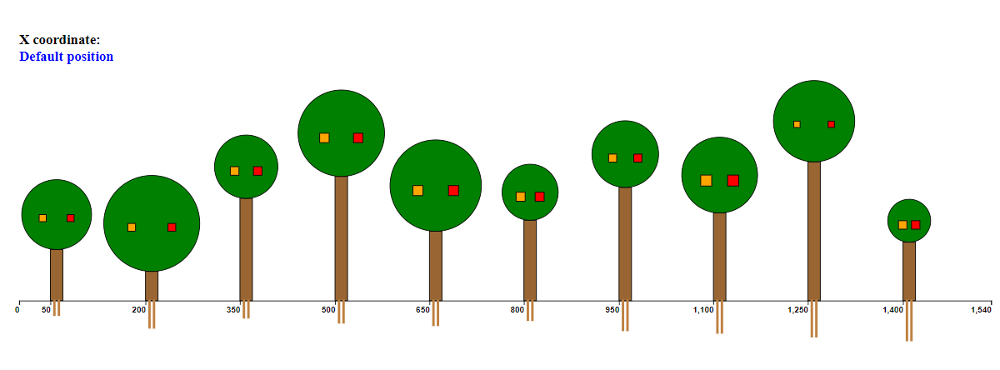
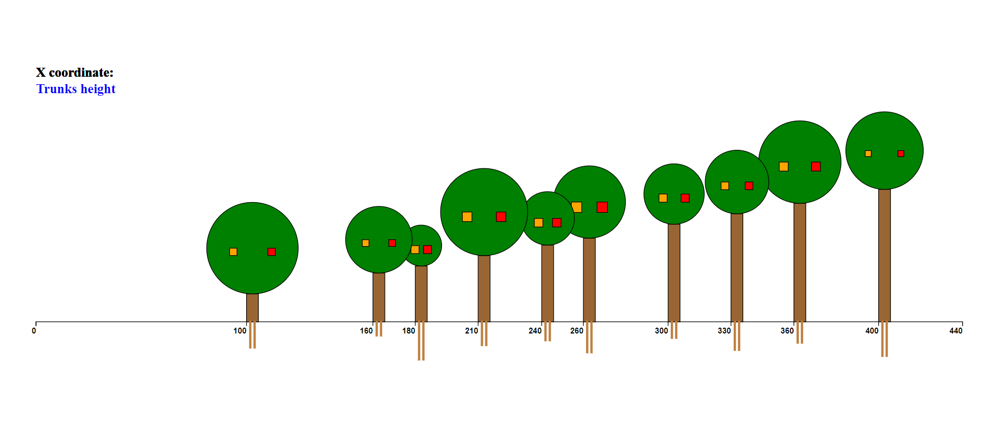

# Interactive-trees-disposition
This repository contains the individual project for the Information Visualization course. 
The drawing is composed by trees, each tree corresponds to a data-case described in the json data file.
Each tree is represented by two roots (small rects), a trunk (rect), a crown (circle) and two fruits (squares). 
The only size of the roots (extracted from json) is the root height, whereas the width is fixed. 
The size of the trunks (extracted from json) is the trunk height, whereas the width is fixed. 
The size of the crowns (extracted from json) is the crown area; to draw the crowns the radius (obtained from the area) is used. 
The size of the fruits (extracted from json) is the fruit area; to draw the fruits the side of the square is calculated from the area. 
 
Example of click on trunks height:  

# Usage
Open the folder that contains index.html and start a server using Python with the command python -m http.server 8080. 
Open your browser on localhost:8080. 
Tap the features of trees to modify the X axis coordinate; for example, after clicking on trunk, the trees are placed horizontally and 
the X coordinate values represent the trunks height.
