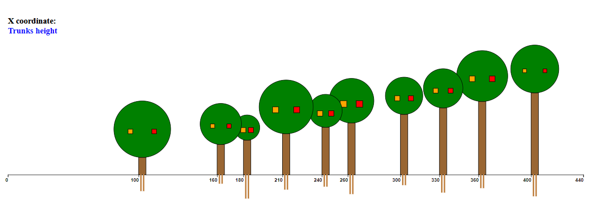

# dynamic-trees-disposition
This repository contains the individual project for the Information Visualization course (D3.js https://d3js.org/). 
The drawing is composed by trees, each tree corresponds to a data-case described in the json data file.
Each tree is represented by two roots (small rects), a trunk (rect), a crown (circle) and two fruits (squares). 

There are also a label and the x axis; the label describes wich features was clicked, namely the values of x coordinate (the y-axis is not required and is not necessary). 
Default trees position: 
 
Example of click on trunks height:  

# Usage
Open the folder that contains index.html and start a server using Python with the command python -m http.server 8080. 
Open your browser on localhost:8080. 
Tap the features of trees to modify the X axis coordinate; for example, after clicking on trunk, the trees are placed horizontally and 
the X coordinate values represent the trunks height.
